<h1 align="center">NanoNature - A Niche Blog</h1>

<p align="center">
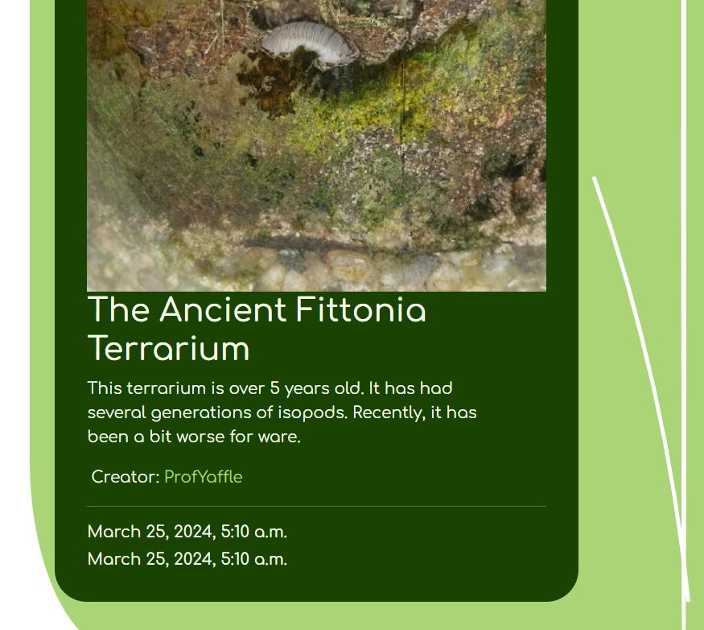
</p>

[AmIResponsive](www.amiresponsive.com) is not happy with my animated content - Work Around In Progress

A full-stack project built using the Django framework with; Python, JavaScript, HTML and CSS. I aim to create a functional blog website for terrarium/bonsai/plant enthusiasts.

# About
NanoNature is a website where users can register for an account, create projects, update projects with entries, and comment on updates from other users. This allows users to record long-term projects and share them with other hobbyists. The website is primariliy targeted at a community united around a particular hobby (hereafter referred to as <b>'nano-gardening'</b>), but the format could be easily adjusted to any hobby with visibile progress over time. 

# Table of Contents 
1. [UX](#ux)
    - [User Stories](#user-stories)

2. [Scope](#scope)
    - [Features](#features)
    - [Future Features](#future-features)
    - [Wireframes](#wireframes)

3. [Structure](#structure)

4. [Database schema](#database-schema)

5. [Surface](#surface)

6. [Technologies Used](#technologies-used)

7. [Testing](#testing)

8. [Deployment](#deployment)

9. [Credits](#credits)

#
# UX
Using the core UX principles I first started with Strategy, thinking about the target audience & the features they would benefit from.

The target audience for NanoNature is:

- Anyone interested in nano-gardening:
  - All ages, genders, abilities
  - All experience levels:
    - Anyone interested in starting out in nano-gardening
    - Anyone interested in sharing their project successes and failures

These users will be looking for:

- A clear and informative website, with intuituve navigation
- A UI/UX that is minimalistic and emphasises the content and theme.
- The ability to make a user account in order to post content and interact with the community.
- The ability to comment on content in order to ask and answer questions.
- The ability to follow creators and projects of interest

Given the desire to appeal to as broad an audience as possible, UX/UI philosophy will be simple with a focus on content and painless navigation.

## User Stories 

**Epic: Accounts**
- As a site user I can create an account and log in, so that I can post my own projects to the site.
- As a site user I have a user profile where I can provide more information, so that other users can learn more about me and I can learn more about other users.
- As a site user I can register for this site using a variety of pre-existing social media, enhancing cross-site posting . . . and so that I don't have to create yet another personal account for a website.

**Epic: Content Management**
- As a site user I can create, edit and delete my own posts, so that I have control over the content I upload.
- As a site user I can view other users projects and leave comments and likes associated with them, so that there is an interactive community.
- As a site user I can view an About page, so that I can learn about the site's features and see information about the creator/owners.

**Epic: Social & Community Features**
- As a site user I can follow another user, so that I receive notifications when they post content
- As a site user I can search/filter content from other users by tag and add tags to my own content, so that I can better find specific content I am looking for and increase the visibility of my own content.
- As a site user I can see a visual notification if I receive a comment/reply so that I can reply and easily participate in community discussions

#
# Scope 

## Wireframes
All wireframes were created used [Balsamiq](https://balsamiq.com/)

<p align="center">
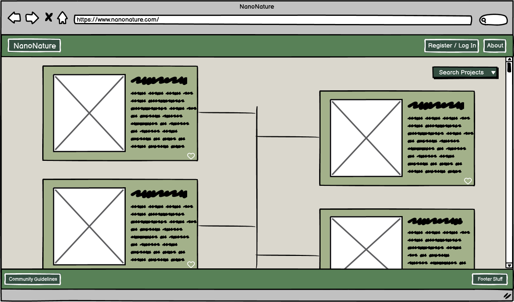
</p>

Wireframes for each device are linked here:
- [Desktop](doc-assets/wireframes/desktop)
- [Mobile](doc-assets/wireframes/mobile)

## **Features**

### **Home Page**
*Navigation bar:* 
- The navigation bar appears on every page allowing users to easily navigate through the site
- Navigation bar has links for 'Home', 'About' and 'Login/Register'
  - Logged in users will also have a 'Logout' and 'Create Project' button highlighted in the navbar
  - Logged in users will also have access to future social features: 'Follows', 'Likes'
- If logged in, username is displayed beneath the navbar.
- The navbar is responsive, collapsing into a triple-bar menu for medium and small screen size

<p align="center">
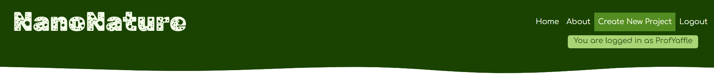
</p>


*Animated Header & Footer:*
- To maintain clean site surface, JavaScript animated in-line SVG tags give a simple but interesting style that doesn't detract from user uploaded images. 
- Both appear on every page.
- Footer contains social links.

<p align="center">

</p>


*Recently added projects:*
- Main content display is a plant-like display of recent projects.
- The content section is fully responsive:
  - Dynamically drawing new 'branches' to content cards as that are created.
  - Collapsing to a single column on small screens.
- Each project title takes the user to the project's details page.
- Each creator name takes the user to that user's profile page.
  - Users can also see title, image, a short about section, creator, and date posted/updated.

<p align="center">
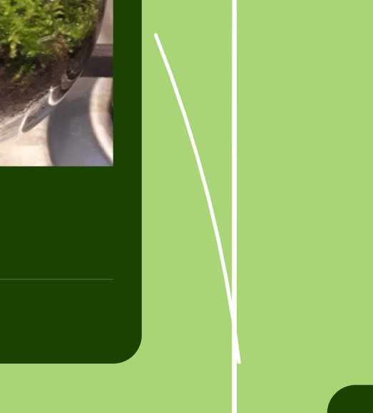
</p>


### **Project Detail View**
- The project page shows the project information at the top of the page.
- The project page displays entries in that project.
- Each entry card will display an image, short description and date posted/updated.
- Each entry card takes users to the project entry details page 

<p align="center">
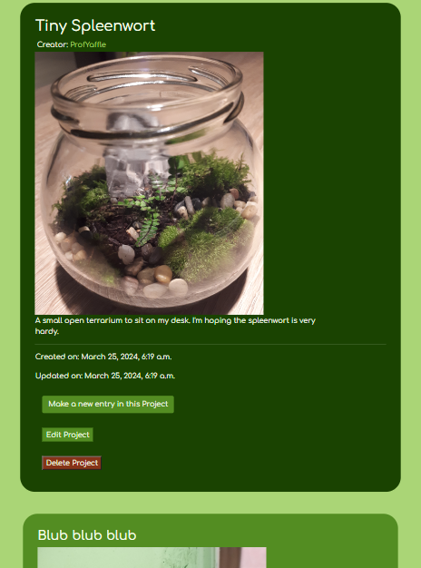
</p>

### **Project Entry Detail View**
- The project entry page shows the project information at the top of the page.
- Each entry card will display an image, creator's name, a short description and date posted/updated.
- Beneath the detail card are 'Next' and 'Prev' buttons to move through the project's entries chronologically.
- At the bottom of the main content is the 'Comments' section:
  - Logged in users may leave, update and delete their own comments
  - Logged in users are empowered to delete comments from other users on their own project entries.

<p align="center">
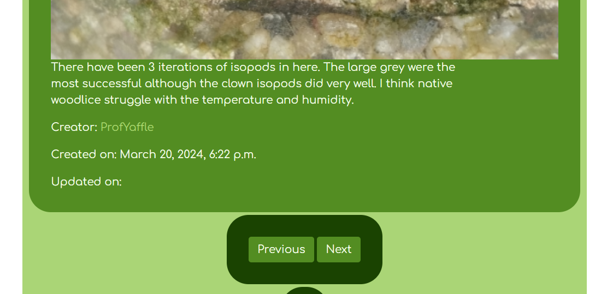
</p>

### **Login/Register**
- The Login / Register button takes users to the login page where they can also find a link to the Register page where they can create an account.
<p align="center">
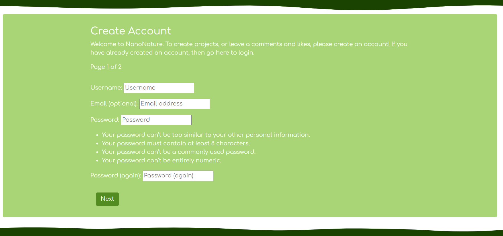
</p>

<p align="center">
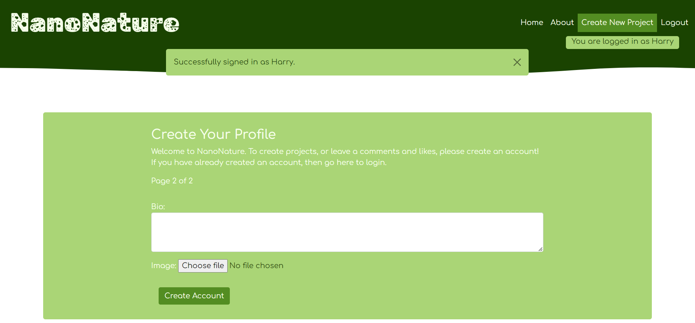
</p>
- At inital registration, a second form is also required to create the user's profile.
<p align="center">
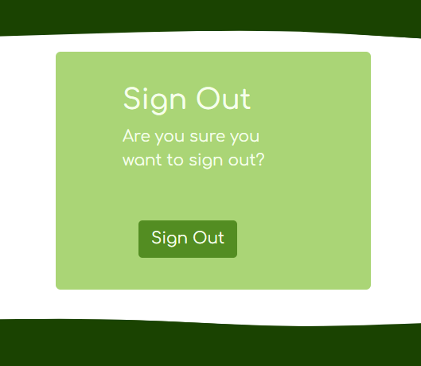
</p>

### **Add Project Page**
- Presents a simple form for users to create their own projects
  - The user must fill in the title and the about fields in order for the recipe to be published.
  - The image is optional and a default will be used if no image is chosen.
- The Create Project button is located at the end of the page, within the navbar for logged in users.
<p align="center">
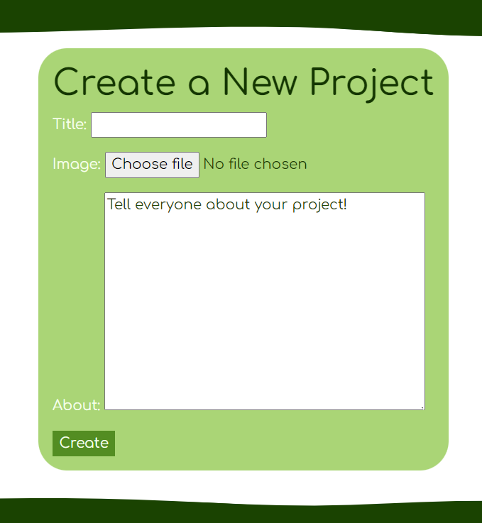
</p>

### **Add Project Entry Page**
- Presents a simple form for users to create an entry in their own projects
  - The user must fill in the title and the about fields in order for the recipe to be published.
  - The image is optional and a default will be used if no image is chosen.
- The Create Project Entry button is located at the bottom of the highlighted project card, in the project view, for logged in users.
<p align="center">
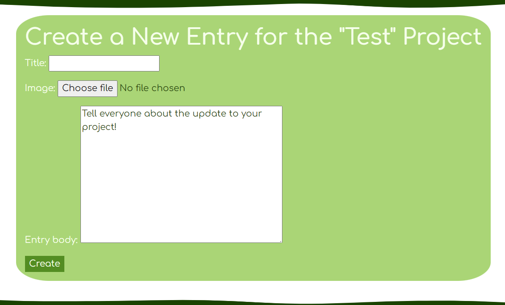
</p>

### Future Features
- Search & Tags
- Follows & Likes
- Social Account Login
- Account Management Page
- Notifications

Unfortunately, I have not been able to complete as many of the planned features as I had intended. Largely due to some significant bugs and suboptimal prioritisation. I plan to continue to update the project beyond the Code Institute course.

#
# Structure

All diagrams were created using [LucidChart](https://lucidchart.com/)

The website is made from two apps:
- plantprojects
  - Handling features and function related to project/card system
- userprofiles
  - Handling profile and social faetures to users


# User Flow Diagram

<p align="center">

</p>


# Database schema

<p align="center">

</p>

## Models

### **Project Model**
<p align="center">
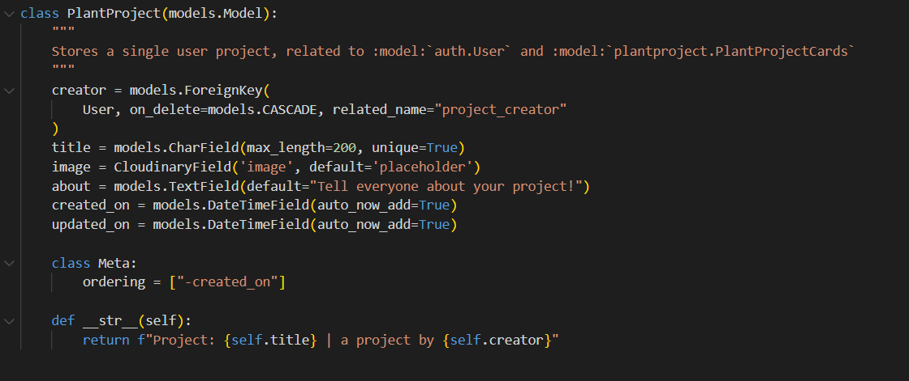
</p>

### **Project Card Model**
<p align="center">
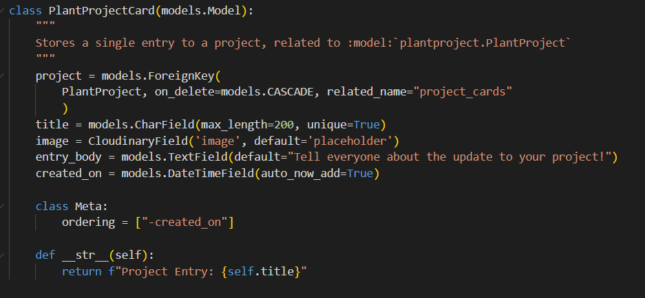
</p>

### **User Profile Model**
<p align="center">
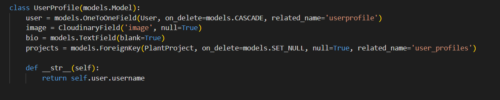
</p>

### **Comment Model**
<p align="center">
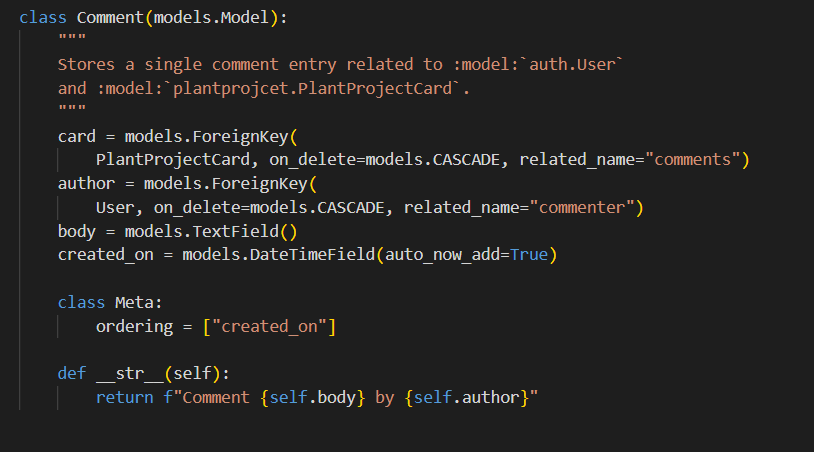
</p>


# Surface

## Design 

Given the desire to appeal to as broad an audience as possible, UX/UI philosophy will be simple with a focus on content. Navigation should be fast and intuitive. Green is the obvious choice for a natural hobby. The style should be simple and plain for maximum content focus. Plain shapes and colours, minimise points and hard corners, fluid & organic.

## Chosen Color 
Color palette from [Coolors](https://coolors.co/)
<p align="center">
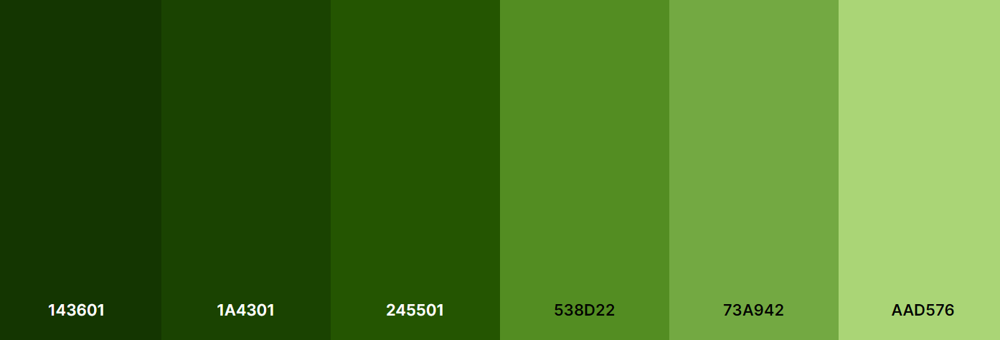
</p>

- **#1A4301** - Header, Footer & Navbar. Also for dark cards in certain views.
- **#143601** - Dark text for high contrast
- **#AAD576** - Main Card conrtainer
- **#538D22** - Focus Card
- **#73A942** - Subfocus card

<p align="center">

</p>

- **#F6FFEB** - An additional colour was created for better light text contrast on certain card styles

## Fonts

Both available through [GoogleFonts](https://fonts.google.com/)
- **Brand font:** Rubik MoonRocks, sans-serif - Used for Brand and certain impact titles
  - Seemingly quite large. In future, be aware of potential impact of font choice.
- **Site Font:** Comfortaa, sans-serif - main font

# Technologies Used

## Languages 
- [HTML5](https://en.wikipedia.org/wiki/HTML5)
- [CSS3](https://en.wikipedia.org/wiki/CSS)
- [Python](https://www.python.org/)
- [JavaScript](https://developer.mozilla.org/en-US/docs/Web/JavaScript)


## Frameworks, Libraries & Programs Used
[GitHub](https://github.com/) - Holds the repository of my project, GitHub connects to GitPod and Heroku.

[GitPod](https://gitpod.io/workspaces) – Connected to GitHub, GitPod hosted the coding space, allowing the project to be built and then committed to the GitHub repository. 

[Heroku](https://www.heroku.com/) - Connected to the GitHub repository, Heroku is a cloud application platform used to deploy this project so the backend language can be utilised/tested. 

[Django](https://www.djangoproject.com/) - The framework used to build  this project

[Gunicorn](https://gunicorn.org/) - Gunicorn - a pure-Python HTTP server for WSGI applications.

[Dj Database URL](https://pypi.org/project/dj-database-url/) - This allows you to utilize the 12factor inspired DATABASE_URL environment variable to configure your Django application.

[Bootstrap](https://getbootstrap.com/) - Base styling

[Cloudinary](https://cloudinary.com/?utm_source=google&utm_medium=cpc&utm_campaign=Rbrand&utm_content=492438439811&utm_term=cloudinary&gclid=Cj0KCQiAt8WOBhDbARIsANQLp96hTerzfFJ_P9lX0tEYEdtM3tSsYB6fhw-x3wQxOO0oc4hXm-A2ZBUaAptIEALw_wcB) - image management

[Pillow](https://pypi.org/project/pillow/) - image mangaement

[Google Fonts](https://fonts.google.com/https://fonts.google.com/) - fonts (via download)

[Font Awesome](https://fontawesome.com/) - icons

[Balsamiq](https://balsamiq.com/) - wireframing

[LucidChart](https://lucidchart.com/) - diagrams

[Am I Responsive](http://ami.responsivedesign.is/) - to check if the site is responsive on different screen sizes.

[PhotoPea](https://photopea.com) - image manipulaiton

[W3C Markup Validator](https://validator.w3.org/#validate_by_input) - was used to validate HTML

[W3C CSS Validator](https://jigsaw.w3.org/css-validator/) - was used to validate CSS

[Beautify](https://www.jpkc.com/tools/beautify/) - was used to correct indentation issues and get rid of too much whitespace - HTML, CSS

[Coolors](https://coolors.co/9df57a-3c444c-fee73b-ff4f98-2daaf3-a9bedb) - to make color palette

[Haikei](https://haikei.app/) - to generate SVG curves

[SVGOMG](https://svgomg.net/) - to optimise SVG curves

[Kute.js](https://thednp.github.io/kute.js/) - to animate the transition between two SVG curve paths

[JS-Lint](https://www.jslint.com/) - was used to validate JavaScript

[CI-Python-Linter](https://pep8ci.herokuapp.com/)

[YouTube](https://youtube.com) - For guidance and inspiration.

<hr>

# Testing


## User Story Testing

### **Testing Users Stories form (UX) Section**

**Epic: Accounts**
- As a site user I can create an account and log in, so that I can post my own projects to the site.
- As a site user I have a user profile where I can provide more information, so that other users can learn more about me and I can learn more about other users.
- As a site user I can register for this site using a variety of pre-existing social media, enhancing cross-site posting . . . and so that I don't have to create yet another personal account for a website.

This was tested by creating an account, logging in and out, viewing the created user profile page

Create Account:
<p align="center">

</p>

<p align="center">

</p>

Login:
<p align="center">
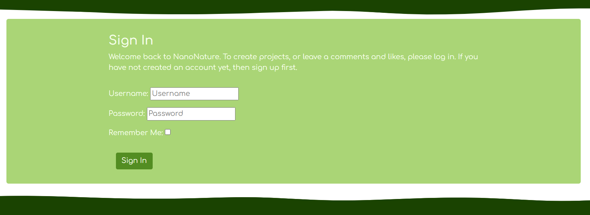
</p>

Logout:
<p align="center">

</p>

User Profile:
<p align="center">
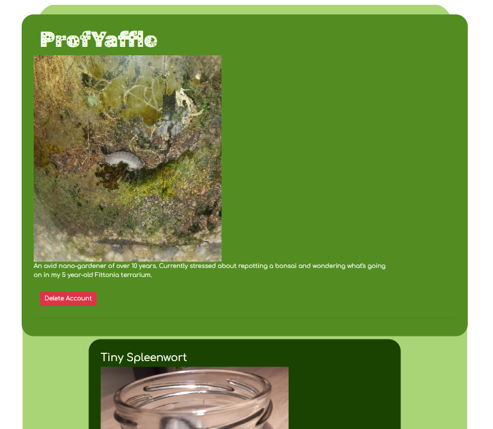
</p>

Django Social login is yet to be implemented.

**Epic: Content Management**
- As a site user I can create, edit and delete my own posts, so that I have control over the content I upload.

<p align="center">

</p>

<p align="center">

</p>

- As a site user I can view other users projects and leave comments and likes associated with them, so that there is an interactive community.

<p align="center">
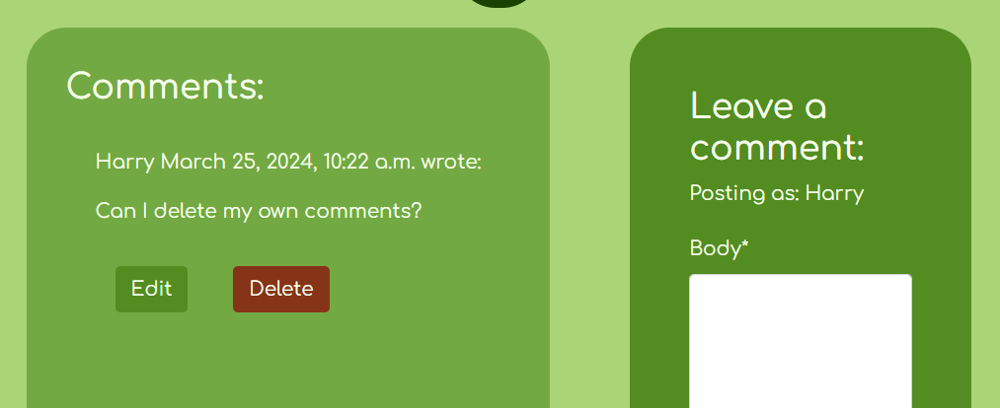
</p>

- As a site user I can view an About page, so that I can learn about the site's features and see information about the creator/owners.
<p align="center">
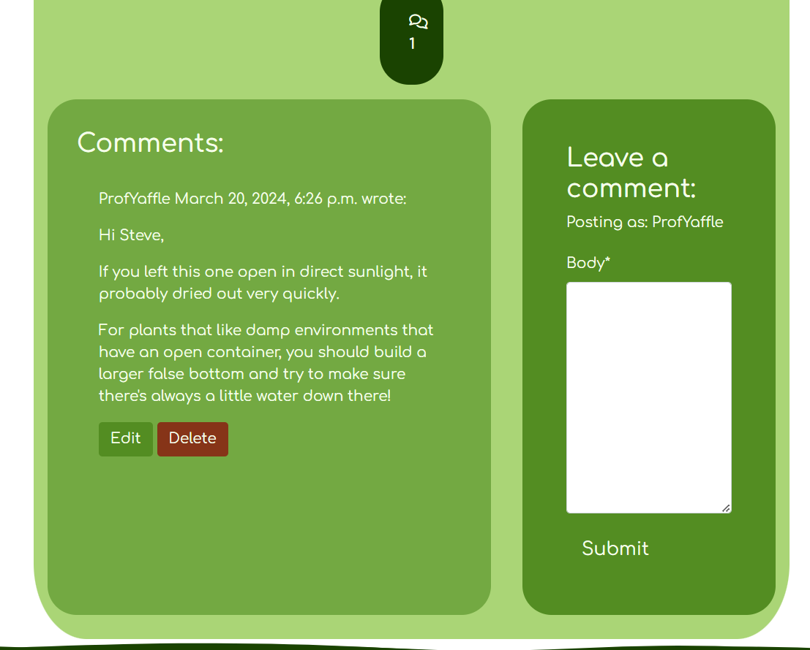
</p>

**Epic: Social & Community Features**
- As a site user I can follow another user, so that I receive notifications when they post content
- As a site user I can search/filter content from other users by tag and add tags to my own content, so that I can better find specific content I am looking for and increase the visibility of my own content.
- As a site user I can see a visual notification if I receive a comment/reply so that I can reply and easily participate in community discussions

Unfortunately, Social & Community Features have been pushed to a future iteration in order to focus on producing a minimum viable product.


## Bugs and Issues
- **Images breaking in dev DB**
  - Fixed by using Pillow, I'm fairly sure it had to do with how an image submitted to a form was passed to Cloudinary/DB. Possibly due to my attempts to implement image compression at the Cloudinary end.

- **Project cards getting smaller with each iteration of For Loop**
  - Nesting issue interacting with styling issue. Resolved with tweaks to HTML and logic.

- **Sign Up Form Refuses to create two entities**
  - Originally planned to have for extending sign in form, to create user profile at the same time as user.
  - Unable to easily modify certain default Django allauth behaviour. Easier approach was to redirect sign up form to "part 2" user profile form.
  - Much annoyance with context and pk's.
  - Fixed but required 2nd fix as result: Logic to check if user signing in via login has already created a user profile and if so to skip form (prevents returning users being directed to form to update user profile on every login).

- **Use of PK**
<p align="center">
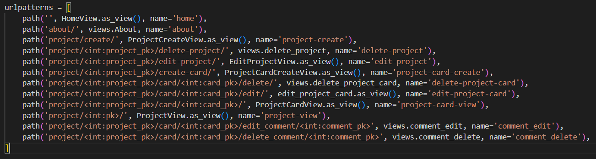
</p>
  - Use of PK's to build urls seemed simple at first.
  - Encountered issue with naming clarity where difficult to identify offending context and how best to make available to views.
  - Required namespace to be assigned to the userprofile app. Further confusion cost time.

- **JavaScript Optimisation**
<p align="center">

</p>
  - Initally had larger, more complex (more interesting) SVG curves for header and footer.
  - Noted to be extremely resource intensive.
  - <p align="center">
    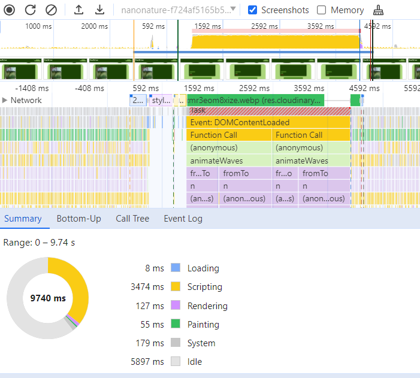
    </p>
  - Reduced delay to page with less complex curve and SVGOMG optimisation. Better compartmentalising of script would also be desirable but less impactful than reducing image size.
  - <p align="center">
    
    </p>

- **Dyanmic Javascript Timeline Branches**
<p align="center">

</p>
  - Much less resource intense than animated header/footer elements.
  - Some delay arises from using a script tag inside of the for loop to dynamically create start/end/bezier points for each iteration of the loop.
  - Pixel tweaking of branches is difficult as current formula very much brute force. A more elegant formula would result in better branches but not likely to improve performance while script tags iterated.
  - I would be very keen to improve this feature further; more elaborate lines/sprial, 'leaves', animated painting of lines.
  - Originally planned to replicate timeline style in User Profile View (to display a user's projects) and in Project View (to display a project's entries). Due to time contraints, the single column responive format is still currently in use on these pages.

- **Deployment Server 500**
  - After an initally very positive deployment, it was noted that a certain URL pattern/View was not displaying: Project Card View.
  - I initailly suspected more context/pk/path issues but was unable to loacte the problem.
  - I was only able to continue after assistance from Coading Coach Martin. Martin identified a migration issue that has resulted in 2 databases. 
  - This likely occured when I made a small change to the comment model in order to get comments to display. I made the migration and migrated, but it did not seem to replicate to the server.


## Validation and Testing

**HTML Validation - [W3-Validator](https://validator.w3.org/nu/#textarea)**
Unresolvable error due to dynamically constructed path:
<p align="center">
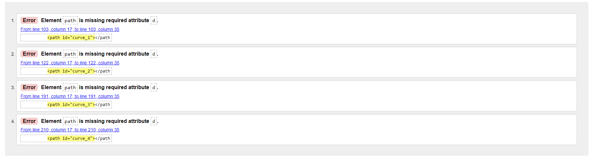
</p>
On pages without timeline branches:
<p align="center">
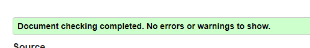
</p>

**CSS Validation - [W3-Jigsaw](https://jigsaw.w3.org/css-validator/)**
<p align="center">
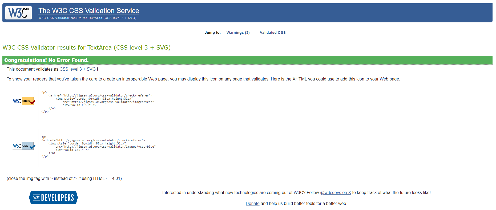
</p>

**JS Validation - [JS-Lint](https://www.jslint.com/)**
Warnings before clean-up:
<p align="center">
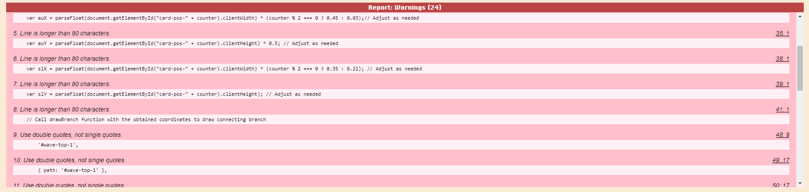
</p>
After cleaning up quotation mark choice errors and some others, only left with these (after 'long lines' excluded)
<p align="center">
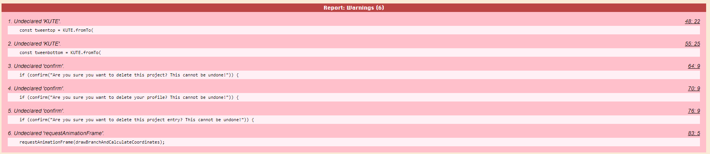
</p>

**Python Linting - [CI-Python-Linter](https://pep8ci.herokuapp.com/)**
<p align="center">
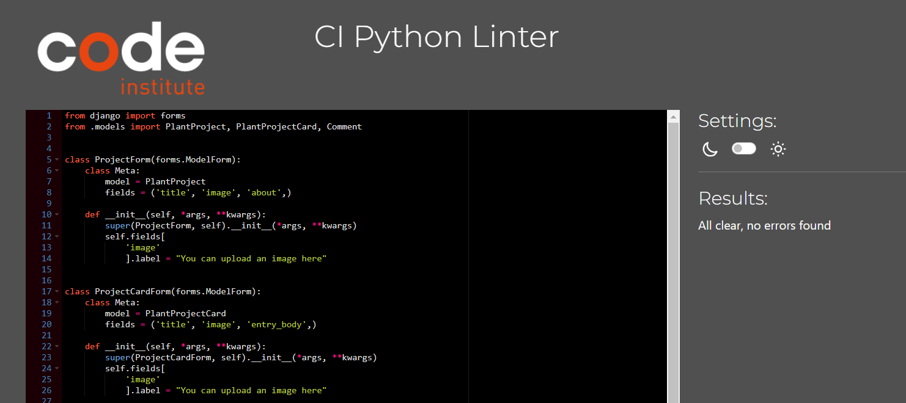
</p>
Most numerous error is 'long lines':
<p align="center">
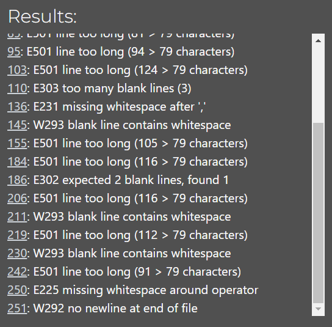
</p>

**Lighthouse Testing**
<p align="center">
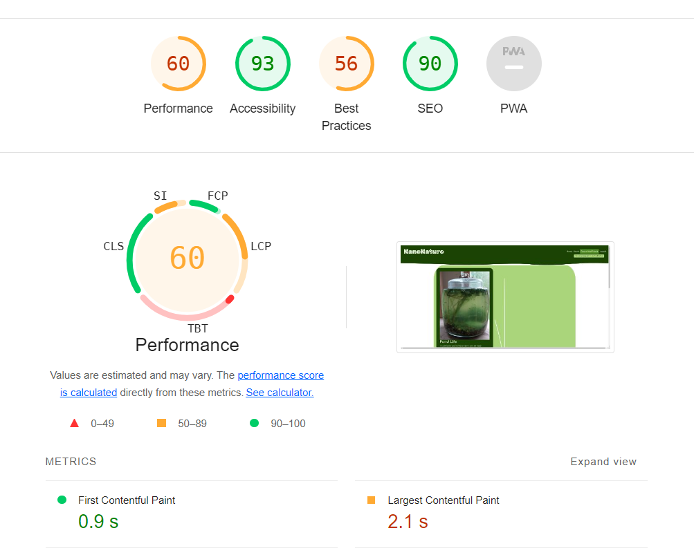
</p>
<p align="center">

</p>
<p align="center">

</p>
After optimising the SVGs, the next most costly operation is the content painting. I attempted to use the cache from Heroku's backend and I tried to use PhotoPea to prepare my images (most are .webp format of less than 150kb). A future focus will be the image handling processes.


# Deployment
This project was deployed using Github and Heroku. It can be viewed [here](https://nanonature-f724af5165b5.herokuapp.com/).

## Github 
A Github repository was created using the following steps:

- Logged into Github.
- Navigated to the 'repositories' section.
- Clicked the green 'new' button to open the 'create new repository' page.
- On this page a repository template was chosen using the dropdown menu.
- The Code Institute template 'gitpod-full-template' was used.
- The repository was named 'nanonature-full-stack' and created by clicking the green 'create repository' button.
- Once created, a Gitpod workspace was opened for the new repository by clicking the green '<> Code' button and selecting Gitpod.

## Django
This project uses the Django fullstack framework. Django can be installed by following these steps:

- In the development environment (Gitpod in my case), type the following command into the terminal:
```
pip3 install django
```
- To name and open a new project, type the following command into the terminal:
```
django-admin startproject *Your project name here*
```
- I used the project name "nanonature". This command will add a django project folder with the given name to the file explorer.
- Create a gitignore file by typing the following command into the terminal:
```
touch .gitignore
```
- Inside the gitignore file, add env.py and any files you wish to be ignored when pushing to git (such as the local db used in development):
```
core.Microsoft*
core.mongo*
core.python*
env.py
__pycache__/
*.py[cod]
node_modules/
.github/
cloudinary_python.txt
db.sqlite3
```
- To check that everything so far is working as intended, run the following command in the terminal:
```
python3 manage.py runserver
```
- This will expose port 8000 and if all is well you should see Django's success page displayed.
- Once that is done, create the inital migrations by running the following command in the terminal:
```
python3 manage.py makemigrations
```
- Then apply these using:
```
python3 manage.py migrate
```
- Create a superuser to allow access to the admin panel using the command ```python3 manage.py createsuperuser```. You will be asked to create a username and password (and optionally an email address).
- To allow Heroku deployment, create a procfile using ```touch Procfile``` and add ```web: gunicorn *Your Project Name Here*.wsgi``` to the Procfile
- After all of the above steps, push the changes to Github by running the following commands:
```
git add .
git commit -m "inital commit"
git push
```

## Allauth
The Django framework contains a package called 'Allauth' which handles registration and sign-in processes. The Allauth documentation contains a [Quickstart](https://docs.allauth.org/en/latest/installation/quickstart.html) with a step-by-step guide. The steps are abbreviated below:
- Run ```pip install django-allauth```
- Inside the settings.py file, add Allauth to INSTALLED_APPS, MIDDLEWARE and SOCIALACCOUNT_PROVIDERS (if using). See [Quickstart documentation](https://docs.allauth.org/en/latest/installation/quickstart.html) for full details
- Inside the urls.py of the project, under urlpatterns, add ```path('accounts/', include('allauth.urls')),```
- Create and apply migrations:
```
python3 manage.py makemigrations
python3 manage.py migrate
```

## Other Packages
Several other packages (such as whitenoise, bootstrap, crispy-forms) were used in the creation of this project. To install all the packages used here in your own project, add the requirements.txt from this repo to your project and run ```pip3 install -r requirements.txt```. This will install all packages, including Django and Allauth, to your project.

## Heroku
Heroku was used to deploy the project. Follow these steps to deploy to Heroku:
- Sign in to Heroku (accounts are free, you can create an account [here](https://signup.heroku.com/))
- Navigate to the dashboard and click the 'New' button, then select 'Create New App'
- Name the app (nanonature in this case), select a nearby region (Europe in my case), and click 'Create App'
- Navigate to the Settings tab on the newly created app and click 'reveal config vars'
- Two external services were used to create a functional production database:
- - Cloudinary for media storage
- - ElephantSQL for the production database itself (WARNING! ElephantSQL has announced it will discontinue service on 27th January 2025. You can read their End of Life Announcement [here](https://www.elephantsql.com/).)
- For Cloudinary, create an account [here](https://cloudinary.com/) or login if you have one already.
- Navigate to the Cloudinary Dashboard and copy the 'API Environment Variable' and add it to the Heroku config vars in the following format: Key = ```CLOUDINARY_URL```, Value = ```cloudinary://*your unique cloudinary API environment variable from your dashboard*```
- For ElephantSQL, create an account [here](https://www.elephantsql.com/) or login if you already have one.
- From the ElephantSQL Dashboard, click the green '+ Create New Instance' button.
- Select the "Tiny Turtle" plan (it's free), you can leave the tags blank.
- Choose the region and select the nearest (or best performing) data centre to your location.
- Click the 'Review' button, then check the details before clicking the 'Create Instance' button.
- Navigate to the newly created instance and locate the details containing the database URL.
- Add the database URL to the Heroku config vars in the following format: Key = ```DB_URL```, Value = ```postgres://*your unique database URL from your ElephantSQL instance dashboard*```
- On Heroku, navigate to the 'Deploy' tab and select the Github deployment method.
- Input the URL of the Github repo and beneath that choose the branch to deploy from.
- Click 'Deploy Branch' and wait for the app to build. Once it has built, click 'View' to see the deployed app.
- Ensure that the Django Secret Key is also added to the Heroku config vars and obfuscate the key in your settings.py file. This is most easily achieved by moving it to the env.py file and ensuring that env.py is on the gitignore list.
- During development, it is advisable to manually deploy at the end of every day and after significant changes.
- In settings.py, ```DEBUG = 'DEBUG' in os.environ```, meaning the debug value is set within the env.py file. This also means that ```DEBUG = False``` in the Heroku deployment. DEBUG can be turned on by adding it to the Heroku config vars but ensure this is removed from the finished project.


# Credits

- [Code Institute](https://codeinstitute.net/ie/) - 'I think therefore I blog' project helped me with recipe details page and pagination
- [Django documentation](https://docs.djangoproject.com/en/4.0/topics/pagination/) - also helped me with pagination and other problems
- Dozens Youtube tutorials, particularly:
  - [Build a Curvaceous Homepage // Wavy Background Tutorial with SVG & CSS by Fireship](https://www.youtube.com/watch?v=lPJVi797Uy0)
  - [How to Create a Vertical Timeline - HTML & CSS Tutorial by dcode](https://www.youtube.com/watch?v=AIDiMA_C3sg)
  - CodeBootCamp, NetNinja and many more.
- [Stack Overflow](https://stackoverflow.com/)
- [CharGPT](https://chat.openai.com/)
- [Code Institute](https://codeinstitute.net/) - For the clear walkthroughs and the previous high quality projects for inspiration and adaptation.

## Media
- All images are my own.

## Acknowledgements
- Thanks to my Mentor Ronan
- Thanks to my Coach and moral support Martin
- Thank you of course to Kevin for being Kevin
- Thank you to Iris and all the CI community, I have thoroughly enjoyed myself!