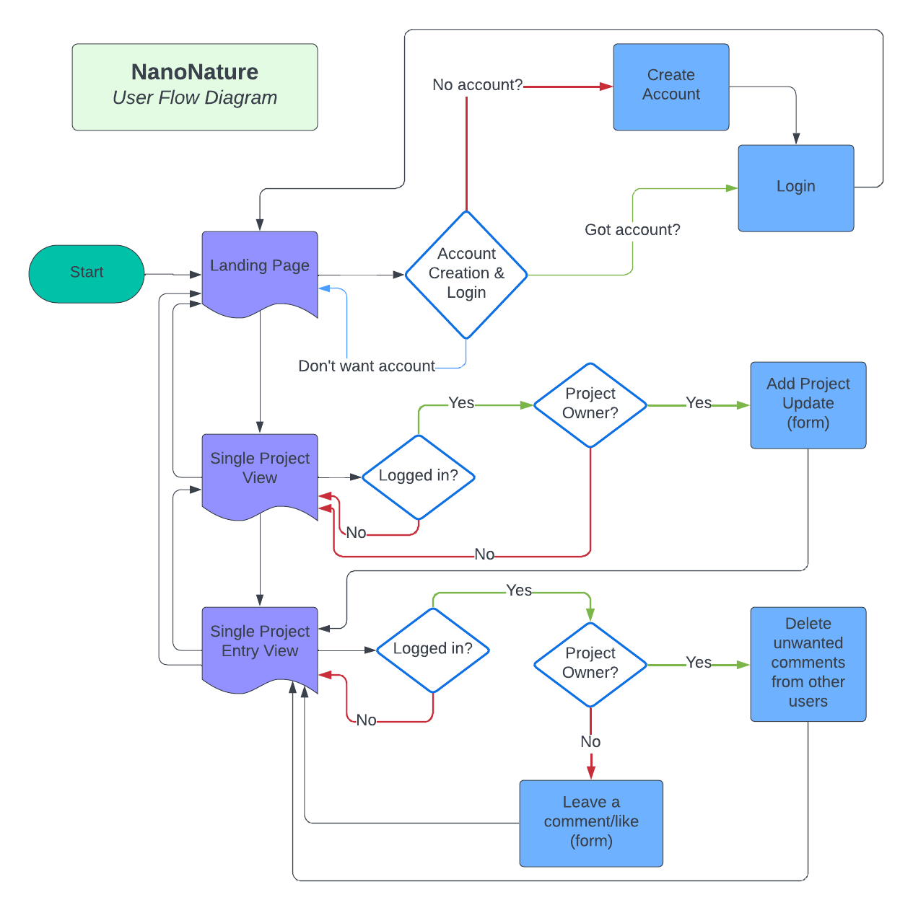

<h1 align="center">NanoNature - A Niche Blog</h1>

A full-stack project built using the Django framework with; Python, JavaScript, HTML and CSS. I aim to create a functional blog website for terrarium/bonsai/plant enthusiasts.

# About
NanoNature is a website where users can register for an account, create projects, update projects with entries, and comment on updates from other users. This allows users to record long-term projects and share them with other hobbyists. The website is primariliy targeted at a community united around a particular hobby (hereafter referred to as <b>'nano-gardening'</b>), but the format could be easily adjusted to any hobby with visibile progress over time. 

# Table of Contents 
1. [UX](#ux)
    - [User Stories](#user-stories)

2. [Scope](#scope)
    - [Features](#features)
    - [Future Features](#future-features)
    - [Wireframes](#wireframes)

3. [Structure](#structure)

4. [Database schema](#database-schema)

5. [Surface](#surface)

6. [Technologies Used](#technologies-used)

7. [Testing](#testing)

8. [Deployment](#deployment)

9. [Credits](#credits)

#
# UX
Using the core UX principles I first started with Strategy, thinking about the target audience & the features they would benefit from.

The target audience for NanoNature is:

- Anyone interested in nano-gardening:
  - All ages, genders, abilities
  - All experience levels:
    - Anyone interested in starting out in nano-gardening
    - Anyone interested in sharing their project successes and failures

These users will be looking for:

- A clear and informative website, with intuituve navigation
- A UI/UX that is minimalistic and emphasises the content and theme.
- The ability to make a user account in order to post content and interact with the community.
- The ability to comment on content in order to ask and answer questions.
- The ability to follow creators and projects of interest

Given the desire to appeal to as broad an audience as possible, UX/UI philosophy will be simple with a focus on content and painless navigation.

## User Stories 

**Epic: TITLE**
- As a site Admin I can ### so that I can ###
- As a site Admin I can ### so that I can ###
- As a site Admin I can ### so that I can ###

#
# Scope 

## Wireframes
All wireframes were created used [Balsamiq](https://balsamiq.com/)

Wireframes for each device are linked here:
- [Desktop](doc-assets/wireframes/desktop)
- [Mobile](doc-assets/wireframes/mobile)

## **Features**

### **Home Page**
*Navigation bar:* 
- The navigation bar appears on every page allowing users to easily navigate through the site
- Navigation bar has links for 'Home', 'About' and 'Login/Register'
  - Logged in users will also have a 'Logout' and 'Create Project' button highlighted in the navbar
  - Logged in users will also have access to future social features: 'Follows', 'Likes'
- If logged in, username is displayed beneath the navbar.
- The navbar is responsive, collapsing into a triple-bar menu for medium and small screen size

*Animated Header & Footer:*
- To maintain clean site surface, JavaScript animated in-line SVG tags give a simple but interesting style that doesn't detract from user uploaded images. 
- Both appear on every page.
- Footer contains social links.

*Recently added projects:*
- Main content display is a plant-like display of recent projects.
- The content section is fully responsive:
  - Dynamically drawing new 'branches' to content cards as that are created.
  - Collapsing to a single column on small screens.
- Each project title takes the user to the project's details page.
- Each creator name takes the user to that user's profile page.
  - Users can also see title, image, a short about section, creator, and date posted/updated.

### **Project Detail View**
- The project page shows the project information at the top of the page.
- The project page displays entries in that project.
- Each entry card will display an image, short description and date posted/updated.
- Each entry card takes users to the project entry details page 

### **Project Entry Detail View**
- The project entry page shows the project information at the top of the page.
- Each entry card will display an image, creator's name, a short description and date posted/updated.
- Beneath the detail card are 'Next' and 'Prev' buttons to move through the project's entries chronologically.
- At the bottom of the main content is the 'Comments' section:
  - Logged in users may leave, update and delete their own comments
  - Logged in users are empowered to delete comments from other users on their own project entries.

### **Login/Register**
- The Login / Register button takes users to the login page where they can also find a link to the Register page where they can create an account.

- At inital registration, a second form is also required to create the user's profile.

### **Add Project Page**
- Presents a simple form for users to create their own projects
  - The user must fill in the title and the about fields in order for the recipe to be published.
  - The image is optional and a default will be used if no image is chosen.
- The Create Project button is located at the end of the page, within the navbar for logged in users.

### **Add Project Entry Page**
- Presents a simple form for users to create an entry in their own projects
  - The user must fill in the title and the about fields in order for the recipe to be published.
  - The image is optional and a default will be used if no image is chosen.
- The Create Project Entry button is located at the bottom of the highlighted project card, in the project view, for logged in users.

### Future Features
- Search & Tags
- Follows & Likes
- Social Account Login
- Account Management Page
- Notifications

#
# Structure

All diagrams were created using [LucidChart](https://lucidchart.com/)

The website is made from two apps:
- plantprojects
  - Handling features and function related to project/card system
- userprofiles
  - Handling profile and social faetures to users

# User Flow Diagram

# Database schema

## Models

### **Project Model**

### **Project Card Model**

### **User Profile Model**

### **Comment Model**

# Surface

## Design 

Given the desire to appeal to as broad an audience as possible, UX/UI philosophy will be simple with a focus on content. Navigation should be fast and intuitive. Green is the obvious choice for a natural hobby. The style should be simple and plain for maximum content focus. Plain shapes and colours, minimise points and hard corners, fluid & organic.

## Chosen Color 
Color palette from [Coolors](https://coolors.co/###)

- **#1A4301** - Header, Footer & Navbar. Also for dark cards in certain views.
- **#143601** - Dark text for high contrast
- **#AAD576** - Main Card conrtainer
- **#538D22** - Focus Card
- **#73A942** - Subfocus card

- **#F6FFEB** - An additional colour was created for better light text contrast on certain card styles

## Fonts

Both available through [GoogleFonts](https://fonts.google.com/)
- **Brand font:** Rubik MoonRocks, sans-serif - Used for Brand and certain impact titles
- **Site Font:** Comfortaa, sans-serif - main font

# Technologies Used

## Languages 
- [HTML5](https://en.wikipedia.org/wiki/HTML5)
- [CSS3](https://en.wikipedia.org/wiki/CSS)
- [Python](https://www.python.org/)
- [JavaScript](https://developer.mozilla.org/en-US/docs/Web/JavaScript)

## Frameworks, Libraries & Programs Used
[GitHub](https://github.com/) - Holds the repository of my project, GitHub connects to GitPod and Heroku.

[GitPod](https://gitpod.io/workspaces) – Connected to GitHub, GitPod hosted the coding space, allowing the project to be built and then committed to the GitHub repository. 

[Heroku](https://www.heroku.com/) - Connected to the GitHub repository, Heroku is a cloud application platform used to deploy this project so the backend language can be utilised/tested. 

[Django](https://www.djangoproject.com/) - The framework used to build  this project

[Gunicorn](https://gunicorn.org/) - Gunicorn - a pure-Python HTTP server for WSGI applications.

[Dj Database URL](https://pypi.org/project/dj-database-url/) - This allows you to utilize the 12factor inspired DATABASE_URL environment variable to configure your Django application.

[Bootstrap](https://getbootstrap.com/) - Base styling

[Cloudinary](https://cloudinary.com/?utm_source=google&utm_medium=cpc&utm_campaign=Rbrand&utm_content=492438439811&utm_term=cloudinary&gclid=Cj0KCQiAt8WOBhDbARIsANQLp96hTerzfFJ_P9lX0tEYEdtM3tSsYB6fhw-x3wQxOO0oc4hXm-A2ZBUaAptIEALw_wcB) - image management

[Pillow](https://pypi.org/project/pillow/) - image mangaement

[Google Fonts](https://fonts.google.com/https://fonts.google.com/) - fonts (via download)

[Font Awesome](https://fontawesome.com/) - icons

[Balsamiq](https://balsamiq.com/) - wireframing

[LucidChart](https://lucidchart.com/) - diagrams

[Am I Responsive](http://ami.responsivedesign.is/) - to check if the site is responsive on different screen sizes.

[PhotoPea](https://photopea.com) - image manipulaiton

[W3C Markup Validator](https://validator.w3.org/#validate_by_input) - was used to validate HTML

[W3C CSS Validator](https://jigsaw.w3.org/css-validator/) - was used to validate CSS

[Beautify](https://www.jpkc.com/tools/beautify/) - was used to correct indentation issues and get rid of too much whitespace - HTML, CSS

[Coolors](https://coolors.co/9df57a-3c444c-fee73b-ff4f98-2daaf3-a9bedb) - to make color palette

[Haikei](https://haikei.app/) - to generate SVG curves

[SVGOMG](https://svgomg.net/) - to optimise SVG curves

[Kute.js](https://thednp.github.io/kute.js/) - to animate the transition between two SVG paths

# Testing

## User Story Testing

### **Testing Users Stories form (UX) Section**

...

## Bugs and Issues
- 

- 

- 

- 

- 

# Deployment
This project was deployed using Github and Heroku.

# Credits

- [Summernote](https://github.com/summernote/django-summernote) - I learn how to change summernote toolbar
- [Code Institute](https://codeinstitute.net/ie/) - 'I think therefore I blog' project helped me with recipe details page and pagination
- [Django documentation](https://docs.djangoproject.com/en/4.0/topics/pagination/) - also helped me with pagination and other problems
- [Search bar](https://www.teckiy.com/blog/implementation-of-search-bar-using-django-in-any-website-2936659075/) - this site is used to help me build Search bar
- [Taste](https://www.taste.com.au/) - all recipes were taken from Taste

## Media
- All images are my own.

## Acknowledgements
- Thanks to my mentor 